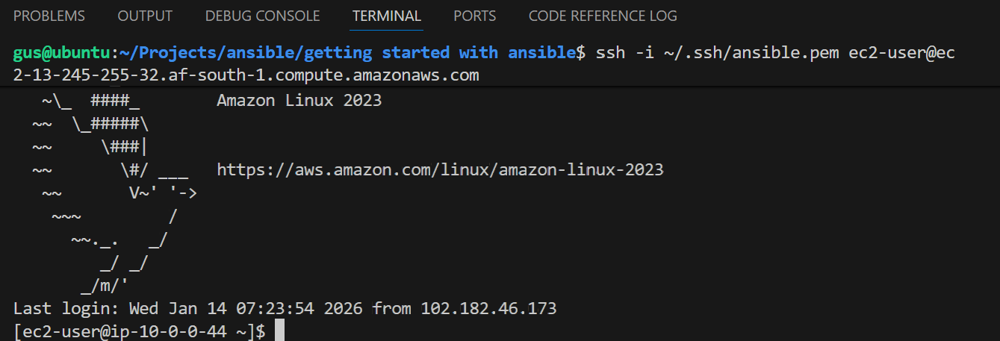
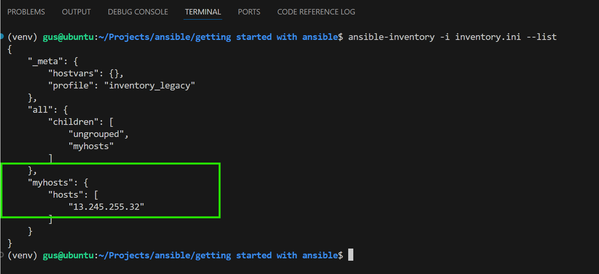
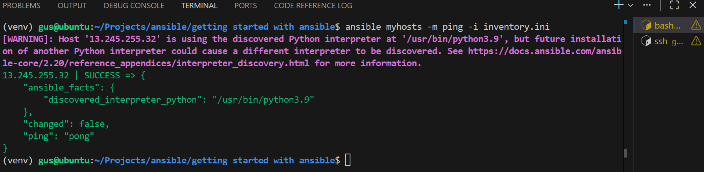
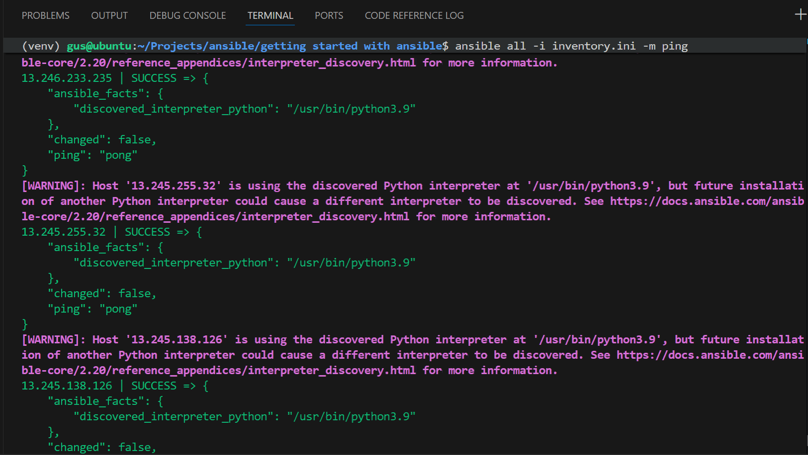

# Getting started with Ansible
## What is Ansible?
Ansible automates the the managemant of remote systems and controls their desired state.
## Controle Node

Ansible environments have three main components:

### Control node
A system on which Ansible is installed. You run Ansible commands such as ansible or ansible-inventory on a control node.

### Inventory
A list of managed nodes that are logically organized. You create an inventory on the control node to describe host deployments to Ansible.

### Managed node
A remote system, or host, that Ansible controls.

Ansible provides open-source automation that reduces complexity and runs everywhere. Ansible lets you automate virtually any task.

### Common use cases for Ansible:

- Eliminate repetition and simplify workflows
- Manage and maintain system configuration
- Continuously deploy complex software
- Perform zero-downtime rolling updates

Ansible uses simple, human-readable scripts called playbooks to automate your tasks. You declare the desired state of a local or remote system in your playbook. Ansible ensures that the system remains in that state.

As automation technology, Ansible is designed around the following principles:

### Agent-less architecture
Low maintenance overhead by avoiding the installation of additional software across IT infrastructure.

### Simplicity
Automation playbooks use straightforward YAML syntax for code that reads like documentation. Ansible is also decentralized, using SSH with existing OS credentials to access to remote machines.

### Scalability and flexibility
Easily and quickly scale the systems you automate through a modular design that supports a large range of operating systems, cloud platforms, and network devices.

### Idempotence and predictability
When the system is in the state your playbook describes, Ansible does not change anything, even if the playbook runs multiple times.

## Creating a virtual environment
Use a virtual environment (Best for development)
```bash
# Create a virtual environment in your project
python3 -m venv venv

# Activate it
source venv/bin/activate

# Install ansible
pip install ansible

# When done, deactivate
deactivate
```
## Start automating with Ansible
### Building an inventory
Inventories organize managed nodes in centralized files that provide Ansible with system information and network locations. Using an inventory file, Ansible can manage a large number of hosts with a single command.

### Note!
You will need the IP address or fully qualified domain name (FQDN) of at least one host system. For demonstration purposes, the host could be running locally in a container or a virtual machine.

## Setting up SSH keys for managed hosts
Before using Ansible, you need to set up passwordless SSH access to your managed hosts.

### For AWS EC2 instances:
If using AWS EC2, you likely already have a key pair. Use the default username for your AMI:
- Amazon Linux: `ec2-user`
- Ubuntu: `ubuntu`
- CentOS/RHEL: `centos` or `ec2-user`

```bash
# Test connection with your existing AWS key
ssh -i /path/to/your-key.pem ec2-user@your-ec2-public-ip
ssh -i ~/.ssh/ansible.pem ec2-user@your-ec2-public-ip
```

### For other hosts or if you need a new key:

### 1. Generate SSH key (if you don't have one)
```bash
ssh-keygen -t rsa -b 4096
```
Press Enter to accept all defaults.

### 2. Copy your public key to the host (automatically handles adding your public key to the authorized_keys)
```bash
ssh-copy-id username@host_ip_address
```

### 2b. Manual method (if ssh-copy-id is not available)
```bash
# Display your public key
cat ~/.ssh/id_rsa.pub

# SSH to the host and add the key manually
ssh username@host_ip_address
mkdir -p ~/.ssh
echo "your_public_key_content" >> ~/.ssh/authorized_keys
chmod 600 ~/.ssh/authorized_keys
chmod 700 ~/.ssh
exit
```

### 3. Test the connection
```bash
ssh username@host_ip_address
```

You should now be able to SSH without entering a password.

### 4. For multiple hosts
```bash
ssh-copy-id user@host1
ssh-copy-id user@host2
ssh-copy-id user@host3
```
### Verify inventory

#### For INI format:
```bash
ansible-inventory -i inventory.ini --list
ansible all -i inventory.ini -m ping
ansible myhosts -m ping -i inventory.ini
```

#### For YAML format:
```bash
ansible-inventory -i inventory.yaml --list
ansible all -i inventory.yaml -m ping
ansible myhosts -m ping -i inventory.yaml
```


Added more hosts!


## Inventories in INI or YAML format
#### Note!
ini = straightforward and easy to read for a small number of managed nodes.

yaml = number of managed nodes increases

### Declaring unique names for managed nodes that uses the ansible_host field:
```bash
myhosts:
  hosts:
    my_host_01:
      ansible_host: 192.0.2.50
    my_host_02:
      ansible_host: 192.0.2.51
    my_host_03:
      ansible_host: 192.0.2.52
```

## Tips for building inventories
- Ensure that group names are - meaningful and unique. Group names are also case sensitive.

- Avoid spaces, hyphens, and preceding numbers (use floor_19, not 19th_floor) in group names.

- Group hosts in your inventory logically according to their What, Where, and When.

### What
Group hosts according to the topology, for example: db, web, leaf, spine.

### Where
Group hosts by geographic location, for example: datacenter, region, floor, building.

### When
Group hosts by stage, for example: development, test, staging, production.

# Creating a playbook
Playbooks are automation blueprints, in YAML format, that Ansible uses to deploy and configure managed nodes.

### Playbook
A list of plays that define the order in which Ansible performs operations, from top to bottom, to achieve an overall goal.

### Play
An ordered list of tasks that maps to managed nodes in an inventory.

### Task
A reference to a single module that defines the operations that Ansible performs.

### Module
A unit of code or binary that Ansible runs on managed nodes. Ansible modules are grouped in collections with a Fully Qualified Collection Name (FQCN) for each module.

https://github.com/user-attachments/assets/b7bc2b0e-e136-43e1-9521-3136ac86ea5a

### Output
The names that you give the play and each task.

The “Gathering Facts” Ansible gathers information about your inventory.

The status of each task [ok]

The play recap that summarizes results of all tasks in the playbook per host.


---

## About This Project

This project documents my learning journey with Ansible automation. It serves as a hands-on educational resource for understanding infrastructure automation, configuration management, and DevOps practices.

### Learning Objectives
- Master Ansible fundamentals including inventories, playbooks, and modules
- Implement automated configuration management across multiple hosts
- Practice infrastructure as code (IaC) principles
- Gain practical experience with AWS EC2 instance management
- Develop skills in SSH key management and secure remote access

### Educational Purpose
This repository is created for learning and experimentation. It contains practical examples, configurations, and documentation that can help others starting their Ansible journey. Feel free to explore, modify, and learn from the examples provided.

**Note:** This is a learning project. Always follow security best practices and never commit sensitive information like private keys or credentials to version control.
